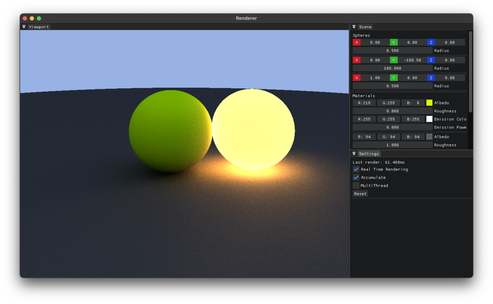

# CPU Ray Tracing (C++ and OpenGL)

Work in progress implementation of a basic raytracer using OpenGL and C++. This is currently performed on the CPU and is expected to be moved on to the GPU later.

